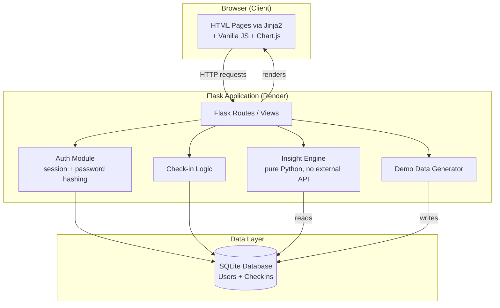
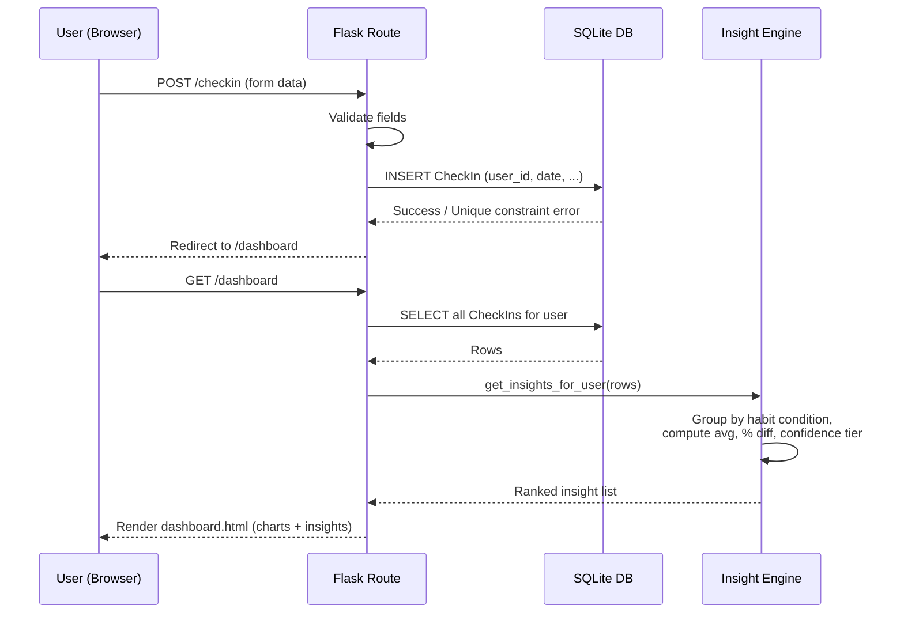
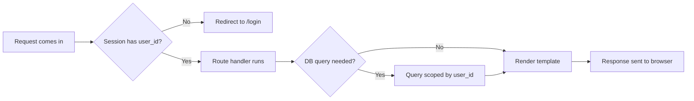

# WhyIFeel — Architecture

Version 1.0 — Day 2 Design Deliverable
AB Talks 60-Day Claude AI Challenge — 10-Day Capstone

## Tech Stack Summary

| Layer | Choice | Rationale |
|---|---|---|
| Backend | Python + Flask | Matches existing skills; minimal boilerplate for a small app |
| Frontend | Jinja2 templates + vanilla JS | No build tooling risk; sufficient for 5 screens |
| Database | SQLite | Zero-config, file-based, free |
| Auth | Flask sessions + Werkzeug password hashing | Built-in, secure, no OAuth/email complexity |
| AI Model/API | None | Self-built statistical insight engine — no external LLM dependency |
| Charts | Chart.js (CDN) | No install step, handles line/bar charts with interactivity |
| Hosting | Render (free tier) | Deploys Flask from GitHub with no credit card required |
| Production server | Gunicorn | Standard WSGI server for Flask deployments |
| Version control | Git + GitHub | Already set up |

## Component Diagram

## Data Flow — Daily Check-in to Dashboard Insight

## Request Lifecycle — Protected Route Example

## AI Interaction

None. No external AI/LLM API is used anywhere in this system. The "insight engine" is a self-contained Python module using statistical comparison (group averages, percentage difference, confidence-by-sample-size). This was a deliberate Day 1 decision to avoid API cost, rate limits, and external dependency, and serves as a stronger engineering showcase for the challenge.

## External Services

Only GitHub (source control) and Render (hosting). No third-party APIs, payment processors, or email services are used in v1.0.

## Notes / Deviations From Day 1 Plan

None. This architecture is a direct, more detailed continuation of the Day 1 PRD and Implementation Blueprint. No redesign occurred.
