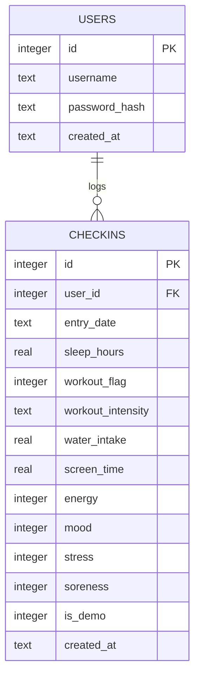

# WhyIFeel — Database Schema

Version 1.0 — Day 2 Design Deliverable

Database: SQLite (file: `instance/whyifeel.db`)

## Entity Relationship Diagram



## Table: users

| Field | Type | Constraints |
|---|---|---|
| id | INTEGER | PRIMARY KEY AUTOINCREMENT |
| username | TEXT | NOT NULL, UNIQUE |
| password_hash | TEXT | NOT NULL |
| created_at | TEXT (ISO datetime) | NOT NULL, DEFAULT CURRENT_TIMESTAMP |

## Table: checkins

| Field | Type | Constraints |
|---|---|---|
| id | INTEGER | PRIMARY KEY AUTOINCREMENT |
| user_id | INTEGER | NOT NULL, FOREIGN KEY -> users(id) ON DELETE CASCADE |
| entry_date | TEXT (YYYY-MM-DD) | NOT NULL |
| sleep_hours | REAL | NOT NULL, CHECK (sleep_hours >= 0 AND sleep_hours <= 24) |
| workout_flag | INTEGER (0/1) | NOT NULL |
| workout_intensity | TEXT | NOT NULL, CHECK (IN ('none','low','medium','high')), DEFAULT 'none' |
| water_intake | REAL | NOT NULL, CHECK (water_intake >= 0) |
| screen_time | REAL | NOT NULL, CHECK (screen_time >= 0 AND screen_time <= 24) |
| energy | INTEGER | NOT NULL, CHECK (energy BETWEEN 1 AND 5) |
| mood | INTEGER | NOT NULL, CHECK (mood BETWEEN 1 AND 5) |
| stress | INTEGER | NOT NULL, CHECK (stress BETWEEN 1 AND 5) |
| soreness | INTEGER | NOT NULL, CHECK (soreness BETWEEN 1 AND 5) |
| is_demo | INTEGER (0/1) | NOT NULL, DEFAULT 0 |
| created_at | TEXT (ISO datetime) | NOT NULL, DEFAULT CURRENT_TIMESTAMP |

**Table-level constraint:** `UNIQUE(user_id, entry_date)` — enforces exactly one check-in per user per calendar day.

## Design Note: the `is_demo` Flag

This field was added during Day 2 design and was not explicit in the Day 1 blueprint. It is required to fulfill the PRD's requirement that generated demo data be clearly distinguishable from real entries ("Includes generated sample data" label) and to allow the demo-data generator to safely avoid overwriting real entries. This is an additive precision fix, not a scope or timeline change.

## Schema Validation Against PRD User Stories

| User Story | Supported By |
|---|---|
| Sign up / log in | `users` table |
| Submit one check-in/day with all 8 fields | `checkins` table — all 8 fields present; UNIQUE constraint enforces one/day |
| View history of past entries | `checkins` filtered by `user_id`, ordered by `entry_date` |
| Delete a past entry | `checkins.id` + `user_id` check before DELETE |
| Insight engine analysis (16 habit-feeling pairs) | All 4 habit fields + 4 feeling fields present and typed for grouping |
| Confidence tiers based on data volume | `entry_date` allows counting relevant days per group |
| Demo data clearly distinguishable | `is_demo` flag |
| Date-range filtering on dashboard | `entry_date` supports range queries |

## SQL Table Creation (Reference — Not Implemented Today)

```sql
CREATE TABLE IF NOT EXISTS users (
    id INTEGER PRIMARY KEY AUTOINCREMENT,
    username TEXT NOT NULL UNIQUE,
    password_hash TEXT NOT NULL,
    created_at TEXT NOT NULL DEFAULT CURRENT_TIMESTAMP
);

CREATE TABLE IF NOT EXISTS checkins (
    id INTEGER PRIMARY KEY AUTOINCREMENT,
    user_id INTEGER NOT NULL,
    entry_date TEXT NOT NULL,
    sleep_hours REAL NOT NULL CHECK (sleep_hours >= 0 AND sleep_hours <= 24),
    workout_flag INTEGER NOT NULL,
    workout_intensity TEXT NOT NULL DEFAULT 'none'
        CHECK (workout_intensity IN ('none','low','medium','high')),
    water_intake REAL NOT NULL CHECK (water_intake >= 0),
    screen_time REAL NOT NULL CHECK (screen_time >= 0 AND screen_time <= 24),
    energy INTEGER NOT NULL CHECK (energy BETWEEN 1 AND 5),
    mood INTEGER NOT NULL CHECK (mood BETWEEN 1 AND 5),
    stress INTEGER NOT NULL CHECK (stress BETWEEN 1 AND 5),
    soreness INTEGER NOT NULL CHECK (soreness BETWEEN 1 AND 5),
    is_demo INTEGER NOT NULL DEFAULT 0,
    created_at TEXT NOT NULL DEFAULT CURRENT_TIMESTAMP,
    UNIQUE(user_id, entry_date),
    FOREIGN KEY(user_id) REFERENCES users(id) ON DELETE CASCADE
);
```

This SQL is documented here for reference only — actual implementation happens on Day 3 per the Implementation Blueprint.
