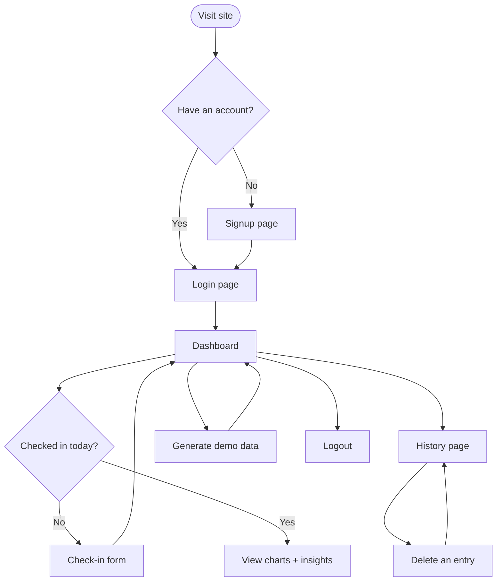

# WhyIFeel — UI & User Flow

Version 1.0 — Day 2 Design Deliverable

## User Flow Diagram



## Screen Flow — Every Screen and Its Reason for Existing

| Screen | Purpose | Why It Exists |
|---|---|---|
| Signup | Create an account | Required for private, per-user data |
| Login | Authenticate | Required to access personal data securely |
| Check-in | Log today's 8 fields | The core data-input action — everything else depends on this |
| Dashboard | View charts + insights | The core "aha" delivery screen — the entire value proposition lives here |
| History | View/delete past entries | Required by PRD for data management; builds trust (user isn't locked in) |

No extra screens (settings, profile, onboarding tutorial, etc.) were added. This matches the PRD's explicit v1.0 scope and avoids scope creep.

## Low-Fidelity Wireframes

### Login / Signup

```
+-----------------------------+
|         WhyIFeel            |
|                              |
|   [ Username           ]    |
|   [ Password           ]    |
|                              |
|      [ Log In Button ]      |
|   Don't have an account?    |
|         Sign up              |
+-----------------------------+
```

### Check-in

```
+-----------------------------+
| Nav: Check-in | Dashboard |  |
|      History | Logout       |
+-----------------------------+
|  HABITS                     |
|  Sleep hours     [___]      |
|  Workout?  ( )Yes ( )No     |
|   Intensity  [Low/Med/High] |
|  Water intake    [___]      |
|  Screen time     [___]      |
|                              |
|  FEELINGS                   |
|  Energy   1 --o------ 5     |
|  Mood     1 ----o---- 5     |
|  Stress   1 --o------ 5     |
|  Soreness 1 ---o----- 5     |
|                              |
|      [ Submit Check-in ]    |
+-----------------------------+
```

### Dashboard

```
+-----------------------------+
| Nav: Check-in | Dashboard |  |
|      History | Logout       |
+-----------------------------+
| Filter: [Last 30 days v]    |
|                              |
| +-----------+ +-----------+ |
| | Trend     | | Correlation| |
| | Line Chart| | Bar Chart  | |
| +-----------+ +-----------+ |
|                              |
| INSIGHTS                    |
| [Confirmed] 40% more energy  |
|   on 7+ hrs sleep            |
| [Early]     Lower stress on  |
|   workout days                |
|                              |
|   [ Generate Demo Data ]     |
+-----------------------------+
```

### History

```
+-----------------------------+
| Nav: Check-in | Dashboard |  |
|      History | Logout       |
+-----------------------------+
| Date       Sleep  Energy ... |
| 2026-07-20  7.5    4    [Del]|
| 2026-07-19  6.0    3    [Del]|
| 2026-07-18  8.0    5    [Del]|
+-----------------------------+
```

## Navigation

A persistent top nav bar (Check-in, Dashboard, History, Logout) appears on every authenticated page, so the user is never more than one click away from any core screen — satisfying the PRD's "friction-free" goal for daily logging.

## Confidence Tier Visual Language (for Day 8 styling reference)

- **Confirmed Pattern** — solid badge, primary/teal color, used for insights with 14+ relevant logged days
- **Early Pattern** — outlined or lighter badge, amber/warning color, used for insights with 5-13 relevant logged days
- Insights below the 5-day threshold are not shown at all, rather than shown with a "no confidence" badge — this avoids cluttering the dashboard with unreliable noise
