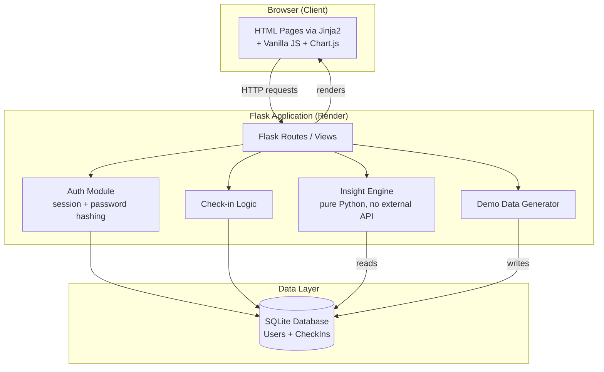
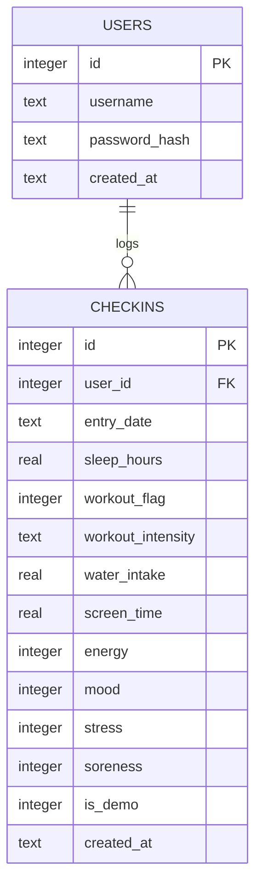
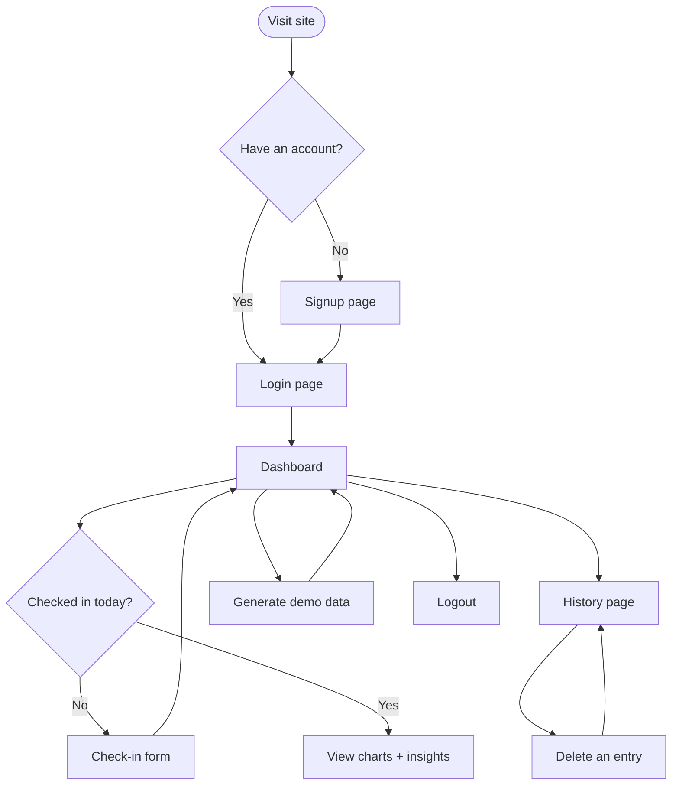

# Day 52 – System Design

## 📌 Overview
Day 52 focused on converting the WhyIFeel product plan into a complete technical blueprint before writing any production code. The architecture, database schema, API specification, UI wireframes, and project structure were finalized based on the approved PRD and Implementation Blueprint from Day 51. The objective was to ensure that Day 3 implementation could begin immediately without redesigning the project.

---

# 📂 Deliverables

## 1. ARCHITECTURE.md
- Finalized technology stack for the application.
- Designed complete system architecture using Mermaid diagrams.
- Documented component interactions, request lifecycle, and data flow.
- Defined external services and deployment architecture.
- Confirmed no deviation from the approved PRD.

---

## 2. SCHEMA.md
- Designed the SQLite database schema.
- Defined Users and Checkins tables.
- Added relationships and constraints.
- Introduced the **is_demo** field for separating generated demo data from real user entries.
- Validated every database field against all PRD user stories.

---

## 3. API.md
Designed the complete server-side route specification.

Included:

- Authentication Routes
- Signup
- Login
- Logout

- Check-in Routes
- Daily Check-in
- History
- Delete Entry

- Dashboard Routes
- Dashboard
- Generate Demo Data

Each endpoint includes:

- Purpose
- Authentication requirements
- Validation rules
- Request format
- Response behavior
- Error cases

---

## 4. UI-WIREFRAMES.md
Designed the complete user experience.

Included:

- User Flow Diagram
- Screen Flow
- Low Fidelity Wireframes
- Navigation Design
- Dashboard Layout
- Check-in Form Layout
- Login & Signup Layout
- History Screen Layout

---

## 5. PROJECT-STRUCTURE.md
Designed the entire folder organization for the project.

Included:

- Flask application structure
- Templates
- Static assets
- Documentation
- Database location
- Testing folder
- Future deployment files

Also documented:

- Why every folder exists
- Which files will be implemented on each remaining day
- Future code organization

---

# 📝 Project Log Update

### ✅ Completed
- Finalized technology stack.
- Designed complete application architecture.
- Created Mermaid architecture diagrams.
- Designed relational database schema.
- Documented API specifications.
- Designed user flow and UI wireframes.
- Finalized project folder structure.
- Validated schema against every PRD user story.
- Confirmed implementation can begin without further planning.

### 🔍 Scope Review
- No unnecessary scope creep detected.
- All features remain aligned with the Day 51 PRD.
- The project remains achievable within the remaining development timeline.

### 🚀 Day 3 Readiness
The project is fully prepared for implementation. All architectural decisions, database design, API contracts, UI planning, and folder structure have been finalized, enabling development to start immediately.

---

# 📸 Screenshots Added

### Technology Stack

| Layer | Choice | Rationale |
|---|---|---|
| Backend | Python + Flask | Matches existing skills; minimal boilerplate for a small app |
| Frontend | Jinja2 templates + vanilla JS | No build tooling risk; sufficient for 5 screens |
| Database | SQLite | Zero-config, file-based, free |
| Auth | Flask sessions + Werkzeug password hashing | Built-in, secure, no OAuth/email complexity |
| AI Model/API | None | Self-built statistical insight engine — no external LLM dependency |
| Charts | Chart.js (CDN) | No install step, handles line/bar charts with interactivity |
| Hosting | Render (free tier) | Deploys Flask from GitHub with no credit card required |
| Production server | Gunicorn | Standard WSGI server for Flask deployments |
| Version control | Git + GitHub | Already set up |

---

### Architecture Diagram



---

### Database Schema

## Entity Relationship Diagram



## Table: users

| Field | Type | Constraints |
|---|---|---|
| id | INTEGER | PRIMARY KEY AUTOINCREMENT |
| username | TEXT | NOT NULL, UNIQUE |
| password_hash | TEXT | NOT NULL |
| created_at | TEXT (ISO datetime) | NOT NULL, DEFAULT CURRENT_TIMESTAMP |

## Table: checkins

| Field | Type | Constraints |
|---|---|---|
| id | INTEGER | PRIMARY KEY AUTOINCREMENT |
| user_id | INTEGER | NOT NULL, FOREIGN KEY -> users(id) ON DELETE CASCADE |
| entry_date | TEXT (YYYY-MM-DD) | NOT NULL |
| sleep_hours | REAL | NOT NULL, CHECK (sleep_hours >= 0 AND sleep_hours <= 24) |
| workout_flag | INTEGER (0/1) | NOT NULL |
| workout_intensity | TEXT | NOT NULL, CHECK (IN ('none','low','medium','high')), DEFAULT 'none' |
| water_intake | REAL | NOT NULL, CHECK (water_intake >= 0) |
| screen_time | REAL | NOT NULL, CHECK (screen_time >= 0 AND screen_time <= 24) |
| energy | INTEGER | NOT NULL, CHECK (energy BETWEEN 1 AND 5) |
| mood | INTEGER | NOT NULL, CHECK (mood BETWEEN 1 AND 5) |
| stress | INTEGER | NOT NULL, CHECK (stress BETWEEN 1 AND 5) |
| soreness | INTEGER | NOT NULL, CHECK (soreness BETWEEN 1 AND 5) |
| is_demo | INTEGER (0/1) | NOT NULL, DEFAULT 0 |
| created_at | TEXT (ISO datetime) | NOT NULL, DEFAULT CURRENT_TIMESTAMP |

**Table-level constraint:** `UNIQUE(user_id, entry_date)` — enforces exactly one check-in per user per calendar day.

## Design Note: the `is_demo` Flag

This field was added during Day 2 design and was not explicit in the Day 1 blueprint. It is required to fulfill the PRD's requirement that generated demo data be clearly distinguishable from real entries ("Includes generated sample data" label) and to allow the demo-data generator to safely avoid overwriting real entries. This is an additive precision fix, not a scope or timeline change.

## Schema Validation Against PRD User Stories

| User Story | Supported By |
|---|---|
| Sign up / log in | `users` table |
| Submit one check-in/day with all 8 fields | `checkins` table — all 8 fields present; UNIQUE constraint enforces one/day |
| View history of past entries | `checkins` filtered by `user_id`, ordered by `entry_date` |
| Delete a past entry | `checkins.id` + `user_id` check before DELETE |
| Insight engine analysis (16 habit-feeling pairs) | All 4 habit fields + 4 feeling fields present and typed for grouping |
| Confidence tiers based on data volume | `entry_date` allows counting relevant days per group |
| Demo data clearly distinguishable | `is_demo` flag |
| Date-range filtering on dashboard | `entry_date` supports range queries |

---

### API Design

| Method | Path | Auth | Purpose |
|---|---|---|---|
| GET | /signup | No | Show signup form |
| POST | /signup | No | Create account |
| GET | /login | No | Show login form |
| POST | /login | No | Authenticate |
| POST | /logout | Yes | End session |
| GET | /checkin | Yes | Show check-in form |
| POST | /checkin | Yes | Submit check-in |
| GET | /history | Yes | List past entries |
| POST | /checkin/delete/<id> | Yes | Delete an entry |
| GET | /dashboard | Yes | View charts + insights |
| POST | /generate-demo-data | Yes | Seed demo data |

---

### User Flow



---

### Wireframes

### Login / Signup

```
+-----------------------------+
|         WhyIFeel            |
|                              |
|   [ Username           ]    |
|   [ Password           ]    |
|                              |
|      [ Log In Button ]      |
|   Don't have an account?    |
|         Sign up              |
+-----------------------------+
```

### Check-in

```
+-----------------------------+
| Nav: Check-in | Dashboard |  |
|      History | Logout       |
+-----------------------------+
|  HABITS                     |
|  Sleep hours     [___]      |
|  Workout?  ( )Yes ( )No     |
|   Intensity  [Low/Med/High] |
|  Water intake    [___]      |
|  Screen time     [___]      |
|                              |
|  FEELINGS                   |
|  Energy   1 --o------ 5     |
|  Mood     1 ----o---- 5     |
|  Stress   1 --o------ 5     |
|  Soreness 1 ---o----- 5     |
|                              |
|      [ Submit Check-in ]    |
+-----------------------------+
```

### Dashboard

```
+-----------------------------+
| Nav: Check-in | Dashboard |  |
|      History | Logout       |
+-----------------------------+
| Filter: [Last 30 days v]    |
|                              |
| +-----------+ +-----------+ |
| | Trend     | | Correlation| |
| | Line Chart| | Bar Chart  | |
| +-----------+ +-----------+ |
|                              |
| INSIGHTS                    |
| [Confirmed] 40% more energy  |
|   on 7+ hrs sleep            |
| [Early]     Lower stress on  |
|   workout days                |
|                              |
|   [ Generate Demo Data ]     |
+-----------------------------+
```

### History

```
+-----------------------------+
| Nav: Check-in | Dashboard |  |
|      History | Logout       |
+-----------------------------+
| Date       Sleep  Energy ... |
| 2026-07-20  7.5    4    [Del]|
| 2026-07-19  6.0    3    [Del]|
| 2026-07-18  8.0    5    [Del]|
+-----------------------------+
```

---

### Project Structure

```
WhyIFeel/
|-- app.py                     # Flask entry point: routes, login_required decorator
|-- database.py                # DB connection helper + table creation (init_db)
|-- insight_engine.py          # Pure-Python statistical analysis module (no Flask dependency)
|-- demo_data_generator.py     # Synthetic data seeding logic
|-- requirements.txt           # Python dependencies (Flask, gunicorn, werkzeug, etc.)
|-- Procfile                   # Render/host start command (added Day 10)
|-- .gitignore                 # Excludes venv/, instance/*.db, __pycache__
|-- README.md                  # Project overview + live link (finalized Day 10)
|
|-- templates/                 # Jinja2 HTML templates
|   |-- base.html               # Shared layout + nav bar
|   |-- signup.html
|   |-- login.html
|   |-- checkin.html
|   |-- dashboard.html
|   `-- history.html
|
|-- static/
|   |-- css/
|   |   `-- style.css           # All visual styling (Day 8)
|   `-- js/
|       |-- checkin.js          # Slider labels + conditional workout intensity field
|       `-- dashboard.js        # Chart.js rendering + date filter logic
|
|-- instance/
|   `-- whyifeel.db             # SQLite database file (git-ignored, generated locally)
|
|-- tests/
|   `-- test_insight_engine.py  # Automated unit tests for the insight engine (Day 9)
|
`-- docs/
    |-- architecture_decisions.md
    |-- ARCHITECTURE.md
    |-- SCHEMA.md
    |-- API.md
    |-- UI-WIREFRAMES.md
    |-- PROJECT-STRUCTURE.md
    |-- manual_test_plan.md     # Day 9
    |-- bugs.md                 # Day 9
    |-- demo_script.md          # Day 10
    `-- project_log.md          # Ongoing daily log
```

---

### Day 3 Readiness Review

✅ Realistic timeline: Nothing added today increases scope — the is_demo flag is a one-line schema addition, not new work. Days 3-10 remain achievable at 2-3 hrs/day.

✅ No scope creep: Confirmed the field list (4 habits + 4 feelings), the 5 screens, the 2-table schema, and the "no external AI" decision are all unchanged from Day 1. I did not add any new features today — only precision (exact field types, exact endpoints, exact file layout).

✅ Day 3 can begin immediately: The Day 3 blueprint (venv setup, Flask install, folder structure, DB init) is already satisfied in part by today's repo setup — tomorrow will only need to add the virtual environment, install dependencies, and write init_db() using the exact schema in SCHEMA.md. No ambiguity remains.

One recommendation: In the original Day 3 plan, the folder structure creation step is now redundant since we did it today. I'll update the Implementation Blueprint's Day 3 section to remove that duplicate step, so tomorrow moves straight to environment setup and Flask installation — saving you real time.

---

# 💡 Key Learnings

- A detailed system design minimizes implementation risks and prevents unnecessary redesign during development.
- Designing the database schema early ensures that every feature is backed by an appropriate data model.
- Defining API contracts before coding provides a clear communication layer between frontend and backend.
- Mermaid diagrams are valuable for visualizing component interactions, request lifecycles, and overall architecture.
- Planning the project structure in advance keeps the codebase organized and maintainable throughout development.
- Validating every design decision against the PRD helps prevent scope creep and keeps the project aligned with its original goals.
- Completing architecture, schema, API, and UI planning before implementation significantly improves development speed and confidence.
